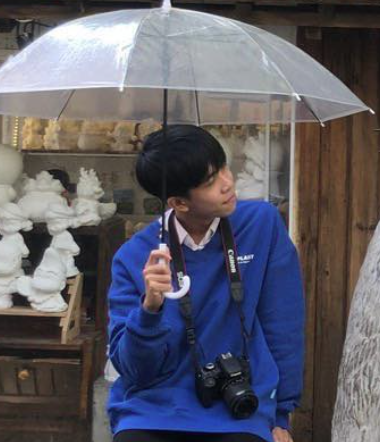
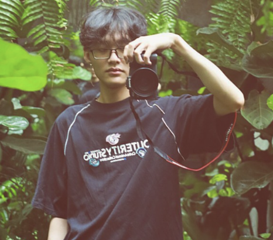

# Analyst Heineken

Nguyen Thi Anh Thu, Thai Le Van, Nguyen Duy Dong, Nguyen Thuc Phuc

## Pipeline


## SOLUTION
- Count the number of people in the images.
  
- Determine how many of them are drinking beers.
  
- Find, count billboard, cartoon box with Heineken’s brand logos.
  
- Analyze the mood and tone of the images (emotional detection).
  
- Identify Context: Determine the setting of the images: dining vs. non-dining, supermarket vs. store.

## Key features of the model:

- No need to use a GPU.
  
- Avoid using paid model APIs (e.g., ChatGPT, Gemini).
  
- Keep training costs low

- No retraining costs when new data is available.

## How to run:

## Getting Started

**Clone the repository and run the web app:**
   ```sh
   git clone <repository-url> && cd <repository-directory>
   streamlit run app.py


## Team ✨

Members

<table>
  <tr>
    <td align="center"><a href="https://www.facebook.com/nguyenthianhthu09"><br /><sub><b>Nguyễn Thị Anh Thư</b></sub></a><br /><a href="https://github.com/nguyenthianhthu0903" title="Code">💻</a> <a href="https://github.com/nguyenthianhthu0903" title="DEV">📖</a> <a href="https://github.com/nguyenthianhthu0903" title="Maintenance">✅</a></td>
      <td align="center"><a href="https://www.facebook.com/thai.vanle.946"><br /><sub><b>Thái Lê Vân</b> </sub></a> </td>
    <td align="center"><a href="https://www.facebook.com/w.terrr"><br /><sub><b>Nguyễn Duy Đông</b> </sub></a> </td>
     <td align="center"><a href="https://www.facebook.com/profile.php?id=100022995554827"><br /><sub><b>Nguyễn Thúc Phúc</b> </sub></a> </td>
  </tr>
  </table>

---
